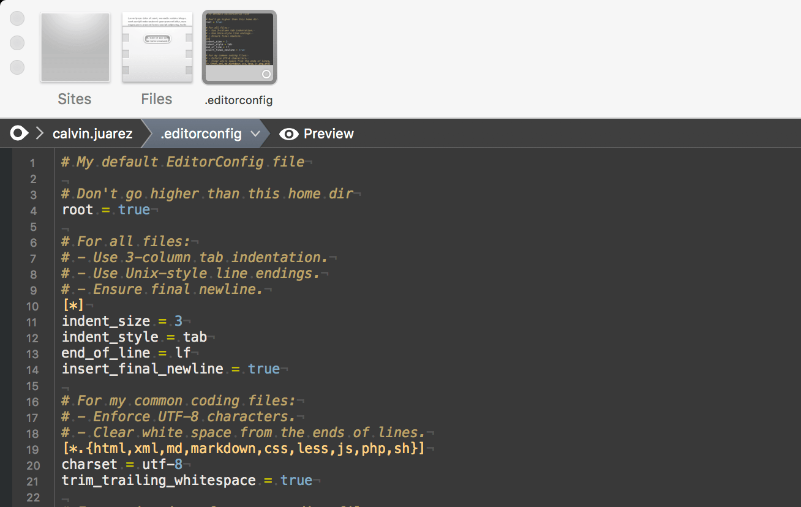

# INI.mode

A minimal [INI-like] syntax mode for [Coda] written by [@calvinjuarez].

## Installation

Download and double click _INI.mode_.

*OR*

[@bobthecow] has some great instructions in his [Mustache.mode] README.md for manual installation:

> Drop `Mustache.mode` into `~/Library/Application Support/Coda 2/Modes` (or `.../Coda/Modes` if
> you're not using Coda 2). If that folder doesn't exist, create it.

## Usage

1.  Install.
2.  Enjoy.

## Extenstions Supported

The following filetypes are supported out of the box:

-   .ini
-   .cnf
-   .gitignore
-   [.editorconfig]
-   .env

Of course, other extensions can be easily added at **Coda > Preferences > Editor**, under "Custom
Syntax Modes".  Furthermore, if you know of an INI-like file that you think should be supported,
please, please update _[ModeSettings.xml](Contents/Resources/ModeSettings.xml)_ and submit a PR.

## Features

Highlighting is intentionally minimal and broad, but is ultimately aimed at improving readability.

-   Both semi-colon (`;`) and hash (`#`) comments are highlighted.
-   Like other syntax modes, comments starting w/ a exclamation mark (`!`) are added to the
    Navigator sidebar.
-   Groups are highlighted and added to the Navigator sidebar.
-   Numbers are (roughly) highlighted.
-   The "keywords" `true`, `false`, and `null` are highlighted.
-   Strings in single- (`'`) or double-quotes (`"`) are highlighted.
-   Equals signs are highlighted.

Additionally, the tab color is the same as the default, in order to avoid dramatically changing how
people's tabs look, and because I'm not sure what would be better just yet (I think probably just a
lighter or darker gray, tbh).

###### Sample

## Contributing

Please do, in the usual way.

[INI-like]: https://en.wikipedia.org/wiki/INI_file
[Coda]: http://panic.com/coda
[@calvinjuarez]: http://github.com/calvinjuarez
[@bobthecow]: https://github.com/bobthecow
[Mustache.mode]: https://github.com/bobthecow/Mustache.mode/blob/master/README.markdown
[.editorconfig]: https://editorconfig.org
